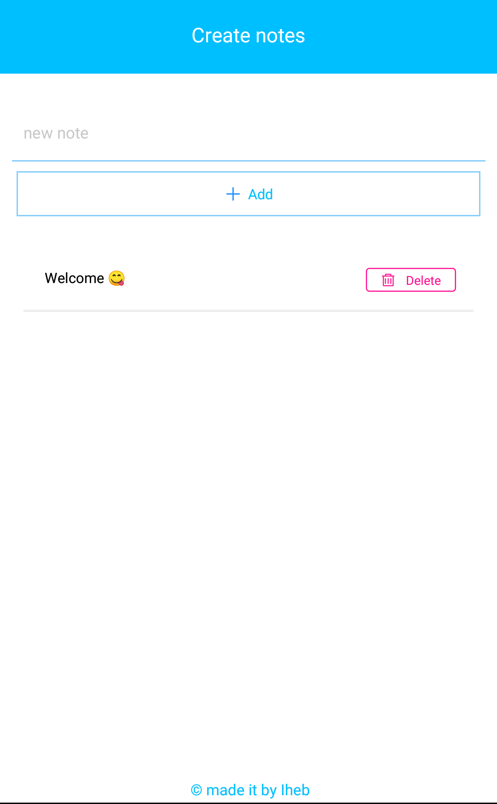

  <h1> my_notes App(mobile version) </h1>
  

<h2>if you want to download the press <a href="https://drive.google.com/file/d/1RHx9u2D8JinF9fBU_CYCo8M28CaAdgkQ/view?usp=sharing">Here</a></h2>
  
<h3>
  what texknologies used for this app:
</h3>
<h4> 
  -used react-native to build the app  
  -Async-Storage to save data locally
<h4/>
  

<h4>my notes app </h4>

  
  
